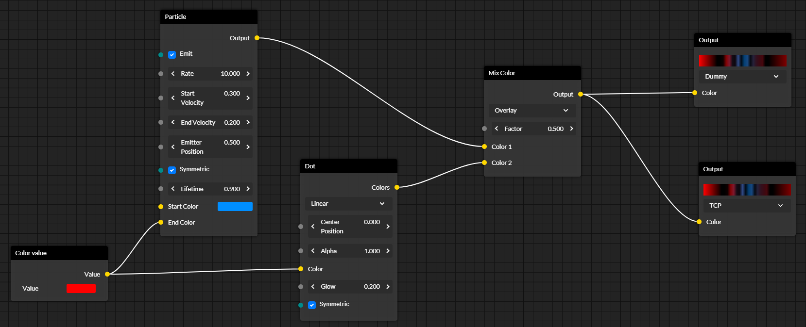

# BaklavaJS

[](https://travis-ci.org/newcat/baklavajs)
[](https://badge.fury.io/js/baklavajs)

Graph / node editor in the browser using VueJS


## Getting started
First, you need to install the library:
```bash
# npm
npm i baklavajs

# yarn
yarn add baklavajs
```

Now you need to tell Vue to use this library. Add the following code in your application entry file (usually `index.js` or `main.js`):
```js
import BaklavaJS from "baklavajs";
Vue.use(BaklavaJS);
```

The library is now installed and ready to use.
To actually use it, you need to create an `Editor` instance, which you can provide to the editor component.
This is a minimal wrapper component:
```vue
<template>
    <baklava-editor :model="editor"></baklava-editor>
</template>

<script>
import { Editor } from "baklavajs";

export default {
    data() {
        return {
            editor: new Editor()
        }
    }
}
</script>
```

## Further documentation
* [Editor functions](docs/editor.md)
* [Creating custom nodes](docs/nodes.md)
* [Customize styles and colors](docs/styling.md)
* [API Reference](docs/api.md)

## Roadmap
* Add panning for all nodes
* Optional keyboard shortcuts