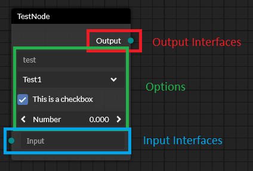

# Creating Custom Nodes <!-- omit in toc -->

- [Basics](#basics)
  - [Node Interfaces](#node-interfaces)
- [Custom Node Implementation](#custom-node-implementation)
  - [Node Builder](#node-builder)
  - [Class](#class)
- [Calculation](#calculation)

## Basics
Every node consists of three parts:
* Output Interfaces
* [Options](/node-options.md)
* Input Interfaces



All of these parts are customizable.

### Node Interfaces

Interfaces are used to receive data from other nodes (*input interfaces*) or send data to other nodes (*output interfaces*).
Each node interface is identified by its name (this also means, every interface on a single node must have a unique name).
An input interface, which is not connected, can display a node option to allow the user to change its value. The option will automatically be hidden when the interface is connected.

> When providing complex default values like arrays or objects as default values using the NodeBuilder's
> [addInputInterface](!!API%{ "module": "@baklavajs/core", "type": "class", "name": "NodeBuilder", "field": "addInputInterface"}%) method,
> you need to provide a function that returns the default array or object.
> This ensures that multiple instances of the node interface all have their own data objects.

## Custom Node Implementation
There are two ways to create custom nodes:

### Node Builder
The [NodeBuilder](!!API%{ "module": "@baklavajs/core", "type": "class", "name": "NodeBuilder" }%) is a simple way to build nodes "on the fly".
```js
import { NodeBuilder } from "@baklavajs/core";

export default new NodeBuilder("MathNode")
    .setName("Math")
    .addInputInterface("Number 1", "NumberOption", 1)
    .addInputInterface("Number 2", "NumberOption", 10)
    .addOption("Operation", "SelectOption", "Add", undefined, {
        items: [ "Add", "Subtract" ]
    })
    .addOutputInterface("Output")
    .onCalculate((n) => {
        const n1 = n.getInterface("Number 1").value;
        const n2 = n.getInterface("Number 2").value;
        const operation = n.getOptionValue("Operation");
        let result;
        if (operation === "Add") {
            result = n1 + n2;
        } else if (operation === "Subtract") {
            result = n1 - n2;
        }
        n.getInterface("Output").value = result;
    })
    .build();
```

> Don't forget to `build()` at the end.

### Class
If you have a more complex node, you can create a subclass of `Node`
and implement the required methods/properties yourself.
```js
import { Node } from "@baklavajs/core";

export class MathNode extends Node {

    type = "MathNode";
    name = "Math";

    constructor() {
        super();
        this.addInputInterface("Number 1", "NumberOption", 1);
        this.addInputInterface("Number 2", "NumberOption", 10);
        this.addOutputInterface("Output");
        this.addOption("Operation", "SelectOption", {
            selected: "Add",
            items: [ "Add", "Subtract" ]
        });
    }

    public calculate() {
        const n1 = this.getInterface("Number 1").value;
        const n2 = this.getInterface("Number 2").value;
        const operation = this.getOptionValue("Operation").selected;
        let result;
        if (operation === "Add") {
            result = n1 + n2;
        } else if (operation === "Subtract") {
            result = n1 - n2;
        }
        this.getInterface("Output").value = result;
    }

}
```

## Calculation
Each Node class can overwrite the `calculate()` function to perform some logic.
Usually the calculation functions reads the values from the input interfaces and the options,
performs some logic and sets the values of the output interfaces with the results.

This technique is used by the [Engine](plugins/engine.md) plugin.

For a node, that outputs the sum of its two inputs, the calculation function could look like this:
```js
calculate() {
    const a = this.getInterface("Number 1").value;
    const b = this.getInterface("Number 2").value;
    this.getInterface("Output").value = a + b;
}
```

## Overriding the name of a Node Interface or Node Option

Keys for interfaces and options must be unique.
Still, sometimes you may want two interfaces or options to have the same name.
You can do this by passing the additional property `displayName` when adding the interface/option:

```js
this.addInputInterface("number1", "NumberOption", 1, { displayName: "Number" });
this.addInputInterface("number2", "NumberOption", 1, { displayName: "Number" });
```
